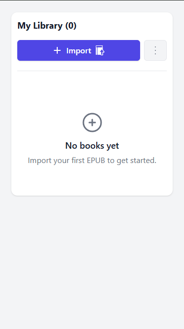
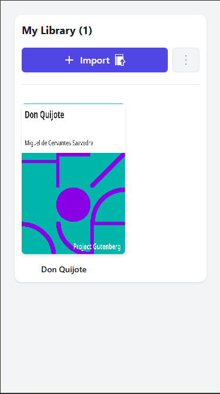
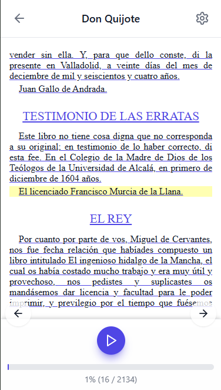
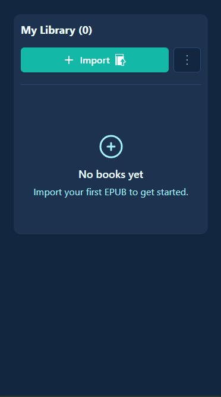
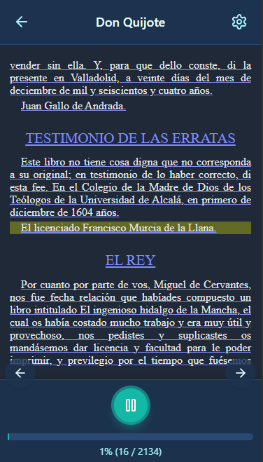
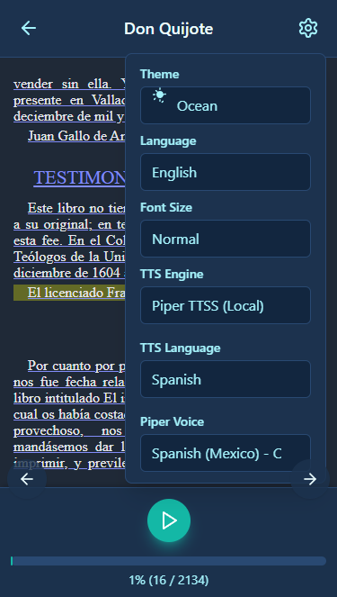

# 📚 read-me-a-book

**read-me-a-book** es una herramienta para convertir PDFs (incluyendo escaneados) y texto en archivos de audio. Utiliza OCR para PDFs basados en imágenes y motores TTS locales o servicios gratuitos.

*Nota: Para el desarrollo de este proyecto, se utilizaron herramientas de IA como Gemini y ChatGPT como apoyo en la investigación y la realización de pruebas de concepto.*

---

## 📸 Capturas de Pantalla

### 🌞 Tema Light
<div align="center">
  
  
  <br>
  
  
</div>

### 🌊 Tema Ocean
<div align="center">
  
  
  <br>
  
  
</div>

---

## 🚀 Características Principales

-   📄 Extracción de texto desde PDFs (digitales y escaneados mediante OCR).
-   🗣️ Conversión de texto a voz utilizando:
    -   **gTTS**: Gratuito, online, fácil de usar.
    -   **Piper TTS**: Local, alta calidad, requiere configuración adicional.
-   ⚙️ Funciona 100% localmente (con Piper TTS) o con conexión a internet (con gTTS).
-   🎶 Une fragmentos de audio generados en un solo archivo (`_full.mp3` o `_full.wav`).
-   🌐 API RESTful con FastAPI y Swagger para una fácil integración.
-   📄 Soporte para procesar rangos de páginas específicos en PDFs.
-   🖼️ Preprocesamiento de imágenes (escala de grises, binarización con Otsu) para mejorar la precisión del OCR.


---

## ⚙️ Tecnologías utilizadas

-   **Python**: Lenguaje principal.
-   **FastAPI**: Para la API web moderna y rápida.
-   **SvelteKit**: Framework frontend moderno.
-   **Pytesseract**: Para Tesseract OCR.
-   **pdf2image**: Para convertir PDFs a imágenes.
-   **gTTS**: Google Text-to-Speech.
-   **Piper TTS**: Motor TTS local (ejecutado a través de `subprocess`).
-   **Pydub**: Para manipulación y unión de audio.
-   **Pillow (PIL)**: Para manipulación de imágenes.
-   **OpenCV (cv2)**: Para preprocesamiento de imágenes.
-   **Numpy**: Para manipulación de arrays de imágenes.
-   **Docker**: Containerización completa de la aplicación.
-   **Caddy**: Proxy reverso con SSL automático.

---

## 🧰 Requisitos
- Python 3.10 o superior.
- Git
- **FFmpeg**: Necesario para `pydub` (manipulación de audio).
    -   Descárgalo desde ffmpeg.org.
    -   Asegúrate de añadir el directorio `bin` de FFmpeg a la variable de entorno PATH de tu sistema.

---
## 🛠️ Herramientas Externas Requeridas

### 1. Tesseract OCR
-   **Por qué**: Para extraer texto de PDFs escaneados (OCR).
-   **Instalación**:
    -   Linux: `sudo apt-get install tesseract-ocr tesseract-ocr-spa`
    -   Windows: Descarga el instalador desde el repositorio oficial de Tesseract en GitHub (UB Mannheim). Durante la instalación, asegúrate de seleccionar los paquetes de idioma que necesites (ej. "Spanish"). Añade la ruta de instalación de Tesseract al PATH del sistema, o configúrala en `backend/src/main.py` (variable `TESSERACT_INSTALL_PATH`).
    -   macOS: `brew install tesseract tesseract-lang`
    -   **Importante**: Para español, se recomienda descargar el archivo `spa.traineddata` (idealmente de `tessdata_best` para mayor precisión) y colocarlo en el directorio `tessdata` de tu instalación de Tesseract (link: https://github.com/tesseract-ocr/tessdata_best/blob/main/spa.traineddata ).
        -   Tessdata_best repository

### 2. Poppler
-   **Por qué**: `pdf2image` lo necesita para convertir PDFs a imágenes.
-   **Instalación**:
    -   Linux: `sudo apt-get install poppler-utils`
    -   **Windows**:
        1.  Descarga los binarios de Poppler. Algunas fuentes comunes son:
            *   Poppler for Windows (oschwartz10612) (busca la última versión, ej. `poppler-24.02.0-0.zip`).
            *   Poppler Binaries by UB Mannheim (a menudo referenciado en la documentación de `pdf2image`).
        2.  Extrae el contenido del archivo ZIP a una ubicación en tu sistema (ej. `C:\poppler-24.02.0`).
        3.  Añade la ruta a la subcarpeta `bin` (que usualmente está dentro de una carpeta como `Library` o directamente, ej. `C:\poppler-24.02.0\Library\bin` o `C:\poppler-24.02.0\bin`) al PATH de tu sistema.
        4.  **Alternativa (Recomendada para Windows)**: En lugar de modificar el PATH del sistema, puedes configurar la ruta a la carpeta `bin` de Poppler directamente en el archivo `backend/src/main.py`. Busca la variable `POPPLER_PATH`, descoméntala si es necesario, y ajústala según tu instalación:
            ```python
            # En backend/src/main.py, ajusta esta línea:
            # POPPLER_PATH = r"C:\Program Files\poppler-24.08.0\Library\bin" # ¡AJUSTA ESTA RUTA!
            ```
            El código en `backend/src/main.py` ya está preparado para usar esta variable si está definida, pasándola al argumento `poppler_path` de `convert_from_path`.
    -   macOS: `brew install poppler`


### 3. Piper TTS (Opcional, para TTS local de alta calidad)

-   **Por qué**: Alternativa local a gTTS, ofrece voces de alta calidad y mayor control, funcionando offline.
-   **Instalación y Configuración**:
    1.  **Descarga el ejecutable de Piper TTS**: Ve al repositorio de Piper en GitHub y descarga la versión adecuada para tu sistema operativo.
    2.  **Coloca el ejecutable**: Guarda `piper.exe` (o el ejecutable correspondiente) en una ubicación accesible.
    3.  **Configura la ruta en `backend/src/main.py`**: Ajusta la variable `PIPER_EXECUTABLE_PATH` en `backend/src/main.py` para que apunte a tu ejecutable de Piper:
        ```python
        # En backend/src/main.py, ajusta esta línea:
        PIPER_EXECUTABLE_PATH = r"C:\Ruta\A\Tu\piper\piper.exe" # ¡AJUSTA ESTA RUTA!
        ```
    4.  **Descarga modelos de voz**:
        *   Los modelos de voz para Piper (archivos `.onnx` y su correspondiente `.onnx.json`) se pueden encontrar en Hugging Face (rhasspy/piper-voices).
        *   Descarga los modelos que desees. Cada modelo generalmente viene con un archivo `.onnx` y un archivo `.onnx.json`.
    5.  **Organiza los modelos**:
        *   Crea una carpeta `models` en la raíz de tu proyecto (al mismo nivel que la carpeta `backend`).
        *   Dentro de `models`, organiza los archivos de voz según la estructura esperada por la configuración `PIPER_VOICES` en `backend/src/main.py`. Por ejemplo, para las voces configuradas:
            *   Para `"es_MX-claude-high"`:
                *   Crea la carpeta `models/es_MX/`.
                *   Coloca `es_MX-claude-high.onnx` (y su `.json` si existe) dentro de `models/es_MX/`.
            *   Para `"es_ES-mls_9972-low"`:
                *   Crea la carpeta `models/es_ES-mls_9972-low/`.
                *   Coloca `es_ES-mls_9972-low.onnx` (y su `.json` si existe) dentro de `models/es_ES-mls_9972-low/`.
            *   La estructura general sería:
                ```
                read-me-a-book/
                ├── backend/
                │   ├── models/
                │   │   ├── es_MX/
                │   │   │   ├── es_MX-claude-high.onnx
                │   │   │   └── es_MX-claude-high.onnx.json (si aplica)
                │   │   └── es_ES-mls_9972-low/
                │   │       ├── es_ES-mls_9972-low.onnx
                │   │       └── es_ES-mls_9972-low.onnx.json (si aplica)
                │   └── src/
                │       └── main.py
                └── README.md
                ```
    6.  **Verifica/Configura las voces en `src/main.py`**: El diccionario `PIPER_VOICES` en `src/main.py` ya define las rutas. Asegúrate de que los nombres de archivo y las rutas coincidan con los modelos que has descargado y su ubicación.
        ```python
        # En src/main.py (esto ya está configurado, solo verifica que tus archivos coincidan):
        PROJECT_ROOT = os.path.dirname(os.path.dirname(os.path.abspath(__file__)))
        PIPER_MODELS_BASE_DIR = os.path.join(PROJECT_ROOT, "models")

        PIPER_VOICES = {
            "es_MX-claude-high": {
                "model_path": os.path.join(PIPER_MODELS_BASE_DIR, "es_MX", "es_MX-claude-high.onnx"),
                "description": "Voz Claude en Español (México) - Alta calidad"
            },
            "es_ES-mls_9972-low": {
                "model_path": os.path.join(PIPER_MODELS_BASE_DIR, "es_ES-mls_9972-low", "es_ES-mls_9972-low.onnx"),
                "description": "Voz MLS en Español (España) - Baja calidad"
            }
            # Añade más voces aquí si es necesario, siguiendo el patrón de rutas.
        }
        ```

---

## 📦 Instalación del Proyecto

### Opción 1: Con Docker (Recomendado)

1.  **Clona el repositorio:**
    ```bash
    git clone https://github.com/tu-usuario/read-me-a-book.git
    cd read-me-a-book
    ```

2.  **Levanta todo con Docker:**
    ```bash
    docker-compose up -d
    ```

3.  **¡Listo!** Abre http://localhost en tu navegador

### Opción 2: Instalación Manual

1.  **Clona el repositorio:**
    ```bash
    git clone https://github.com/tu-usuario/read-me-a-book.git # Reemplaza con la URL de tu repositorio
    cd read-me-a-book
    ```

2.  **Crea un entorno virtual (recomendado):**
    ```bash
    python -m venv venv
    # En Windows
    venv\Scripts\activate
    # En macOS/Linux
    source venv/bin/activate
    ```

3.  **Instala las dependencias de Python:**
    ```bash
    pip install -r backend/requirements.txt
    ```

4.  **Instala dependencias del frontend:**
    ```bash
    cd frontend
    pnpm install
    ```

---

## 🚀 Uso

### Con Docker

1.  **Inicia los servicios:**
    ```bash
    docker-compose up -d
    ```

2.  **Accede a la aplicación:**
    -   **Frontend**: http://localhost
    -   **API Docs**: http://localhost/api/docs

### Sin Docker

1.  **Configura las rutas (si es necesario)**: Verifica que las rutas a Tesseract, Poppler (especialmente en Windows si no está en PATH), y Piper (ejecutable y modelos) estén correctamente configuradas en `backend/src/main.py` como se describe en la sección "Herramientas Externas Requeridas".

2.  **Inicia el backend FastAPI:**
    Desde el directorio raíz del proyecto:
    ```bash
    # Asegúrate de que tu entorno virtual esté activado
    cd backend
    python -m uvicorn src.main:app --reload --host 0.0.0.0 --port 8000
    ```

3.  **Inicia el frontend SvelteKit:**
    ```bash
    cd frontend
    pnpm dev
    ```

4.  **Accede a la aplicación:**
    -   **Frontend**: http://localhost:5173
    -   **API Docs**: http://localhost:8000/docs

### Endpoints de la API

-   `POST /pdf_to_epub`: Convierte un PDF en un EPUB
-   `POST /epub_to_audio`: Convierte un EPUB en un libro de audio
-   `POST /text_to_audio`: Convierte texto a un libro de audio

### Ejemplo de uso con `curl` para `/text_to_audio`:

```bash
curl -X POST -H "Content-Type: application/json" \
             -d '{
                   "text": "Hola mundo, esto es una prueba de conversión de texto a voz.",
                   "lang": "es",
                   "tts_engine": "gtts"
                 }' \
             http://localhost:8000/text_to_audio
```


Para usar Piper TTS:

```bash
curl -X POST -H "Content-Type: application/json" \
             -d '{
                   "text": "Hola mundo con Piper TTS.",
                   "lang": "es",
                   "tts_engine": "piper",
                   "piper_voice": "es_MX-claude-high"
                 }' \
             http://localhost:8000/text_to_audio

```

---
## 📁 Estructura de Carpetas del Proyecto

```
read-me-a-book/
├── backend/                    # API FastAPI (Python)
│   ├── src/
│   │   ├── main.py            # Endpoints principales de la API
│   │   ├── server.py          # Servidor Flask (legacy)
│   │   ├── config.py          # Configuración del backend
│   │   ├── interfaces.py      # Interfaces y contratos
│   │   ├── services/          # Lógica de negocio
│   │   │   ├── pdf_service.py     # Extracción de texto de PDFs
│   │   │   ├── epub_service.py    # Conversión de formatos
│   │   │   ├── audio_service.py   # Generación de audio
│   │   │   └── tts_chunk_service.py # Procesamiento por chunks
│   │   ├── engines/           # Motores TTS
│   │   │   ├── engine_factory.py  # Factory para motores TTS
│   │   │   ├── gtts_engine.py     # Motor Google TTS
│   │   │   └── piper_engine.py    # Motor Piper TTS
│   │   └── utils/             # Utilidades
│   │       └── text_splitter.py   # División de texto en chunks
│   ├── models/                # Modelos de voz Piper TTS
│   │   ├── es_ES-mls_9972-low/
│   │   │   ├── es_ES-mls_9972-low.onnx
│   │   │   └── es_ES-mls_9972-low.onnx.json
│   │   └── es_MX/
│   │       ├── es_MX-ald-medium.onnx
│   │       ├── es_MX-ald-medium.onnx.json
│   │       ├── es_MX-claude-high.onnx
│   │       └── es_MX-claude-high.onnx.json
│   ├── uploads/               # Archivos PDF subidos temporalmente
│   ├── outputs/               # Archivos generados (texto y audio)
│   ├── requirements.txt       # Dependencias Python
│   └── Dockerfile             # Container del backend
├── frontend/                  # Aplicación SvelteKit (JavaScript/TypeScript)
│   ├── src/
│   │   ├── routes/            # Páginas de la aplicación
│   │   │   ├── +layout.svelte     # Layout principal
│   │   │   ├── +page.svelte       # Página de inicio
│   │   │   └── reader/
│   │   │       └── [bookId]/
│   │   │           └── +page.svelte # Lector de libros
│   │   ├── lib/               # Componentes y utilidades
│   │   │   ├── components/         # Componentes Svelte
│   │   │   │   ├── FontSizeSwitcher.svelte
│   │   │   │   ├── LanguageSwitcher.svelte
│   │   │   │   ├── ThemeSwitcher.svelte
│   │   │   │   └── TTSConfigurator.svelte
│   │   │   ├── store/             # Stores de estado
│   │   │   │   ├── book.store.ts
│   │   │   │   └── theme.store.ts
│   │   │   ├── actions/           # Acciones Svelte
│   │   │   │   └── clickOutside.action.ts
│   │   │   └── i18n/              # Internacionalización
│   │   │       ├── en.ts
│   │   │       ├── es.ts
│   │   │       └── index.ts
│   │   ├── app.html           # Template HTML principal
│   │   ├── app.css            # Estilos globales
│   │   └── app.d.ts           # Tipos TypeScript
│   ├── static/                # Assets estáticos
│   │   ├── favicon.png
│   │   ├── icon-180.png
│   │   ├── icon-192.png
│   │   ├── icon-512.png
│   │   └── manifest.webmanifest
│   ├── package.json           # Dependencias Node.js
│   ├── svelte.config.js       # Configuración SvelteKit
│   ├── vite.config.ts         # Configuración Vite
│   ├── tailwind.config.cjs    # Configuración Tailwind CSS
│   └── Dockerfile             # Container del frontend
├── caddy/                     # Configuración del proxy reverso
│   └── Caddyfile              # Configuración de Caddy
├── docker-compose.yml         # Orquestación de servicios Docker
├── docker-compose.override.yml # Configuración de desarrollo
├── env.example                # Variables de entorno de ejemplo
├── .gitignore                 # Archivos ignorados por Git
└── README.md                  # Este archivo
```

### Servicios Docker

El proyecto utiliza Docker Compose para orquestar tres servicios principales:

1. **backend** (FastAPI): Puerto interno 8000
   - API REST para procesamiento de PDFs y generación de audio
   - Endpoints: `/pdf_to_epub`, `/epub_to_audio`, `/text_to_audio`
   - Documentación automática en `/docs`

2. **frontend** (SvelteKit): Puerto interno 80 (producción) / 5173 (desarrollo)
   - Interfaz web moderna y responsive
   - Lector de EPUB integrado
   - Reproductor de audio en tiempo real

3. **caddy** (Proxy Reverso): Puertos 80 y 443 (host)
   - SSL automático con Let's Encrypt
   - Routing inteligente entre frontend y backend
   - Headers de seguridad automáticos
   - Proxy: `/api/*` → backend, `/` → frontend

### Redes y Volúmenes

- **Red**: `app-network` (bridge) para comunicación entre servicios
- **Volúmenes**: 
  - `caddy_data`: Certificados SSL
  - `caddy_config`: Configuración de Caddy
  - Volúmenes montados para desarrollo (hot reload)

---
## 📝 Notas Adicionales

Límites de gTTS: gTTS es un servicio online y puede tener límites en la longitud del texto o frecuencia de solicitudes. El script divide el texto en fragmentos más pequeños (basado en _split_text_into_chunks con max_length=48000) y añade un retraso (time.sleep(5)) entre fragmentos para mitigar problemas. Para textos muy largos o uso intensivo, Piper TTS (local) es más robusto.
Calidad de OCR: La calidad de la extracción de texto OCR depende en gran medida de la calidad del PDF escaneado. El preprocesamiento de imágenes implementado (escala de grises, binarización con Otsu) ayuda, pero los resultados pueden variar.
Configuración de Idioma: Asegúrate de que los paquetes de idioma correctos para Tesseract estén instalados (ej. spa para español, eng para inglés) y que el código de idioma (lang) proporcionado a la API sea compatible con los motores TTS y Tesseract. El script mapea es a spa y en a eng para Tesseract internamente.
Archivos de Salida: Los archivos de audio generados se guardan en la carpeta outputs/ con un nombre base único seguido de _full.mp3 (para gTTS) o _full.wav (para Piper TTS). Los archivos de texto también se guardan en outputs/ con un nombre único y extensión .txt.

---
## 🤝 Contribuciones
Las contribuciones son bienvenidas. Por favor, abre un issue para discutir cambios o un pull request con tus mejoras.

---

## 🏗️ Arquitectura Moderna del Proyecto

### Backend - FastAPI

**FastAPI**: Framework web moderno de Python que reemplaza Flask en esta versión:
- Documentación automática con Swagger/OpenAPI en `/docs`
- Validación automática de datos con Pydantic
- Soporte nativo para async/await
- Rendimiento comparable a NodeJS y Go
- Endpoints RESTful modernos

**Servicios del Backend**:
- **PDF Service**: Extracción de texto usando OCR
- **EPUB Service**: Conversión de formatos usando Calibre
- **Audio Service**: Generación de audio con streaming
- **TTS Engines**: Integración con Piper TTS y gTTS

### Frontend - SvelteKit

**SvelteKit**: Framework full-stack moderno que reemplaza la interfaz básica:
- Renderizado en servidor (SSR) y cliente
- Routing basado en archivos
- Componentes reactivos y eficientes
- Integración con Tailwind CSS para estilos

**Características del Frontend**:
- Interfaz web moderna y responsive
- Lector de EPUB integrado con epubjs
- Reproductor de audio en tiempo real
- Configuración de voces TTS
- Soporte para múltiples idiomas

### Infraestructura - Docker y Caddy

**Docker**: Containerización completa:
- Backend containerizado con Python/FastAPI
- Frontend containerizado con Node.js/SvelteKit
- Volúmenes persistentes para datos
- Redes aisladas entre servicios

**Caddy**: Proxy reverso moderno:
- Configuración automática de SSL con Let's Encrypt
- Routing inteligente entre frontend y backend
- Headers de seguridad automáticos
- Configuración declarativa simple

### Características Técnicas Avanzadas

**Streaming de Audio**:
- Generación y reproducción de audio en tiempo real
- Headers WAV dinámicos para streaming
- Chunking inteligente de texto
- Manejo de errores y reintentos

**Procesamiento Asíncrono**:
- Tareas en segundo plano para conversiones largas
- Manejo de múltiples solicitudes simultáneas
- Limpieza automática de archivos temporales
- Logging detallado para debugging

**Optimización de Rendimiento**:
- Caché de modelos TTS en memoria
- Procesamiento por chunks para archivos grandes
- Compresión de audio optimizada
- Lazy loading de componentes frontend

### Desarrollo y Despliegue

**Desarrollo Local**:
- Hot reload en frontend y backend
- Volúmenes montados para desarrollo
- Logs en tiempo real
- Debugging integrado

**Producción**:
- Build optimizado para producción
- SSL automático con Caddy
- Escalabilidad horizontal
- Monitoreo y logging

Esta arquitectura moderna proporciona una base sólida para el crecimiento del proyecto, manteniendo la compatibilidad con todas las funcionalidades originales de OCR y TTS.